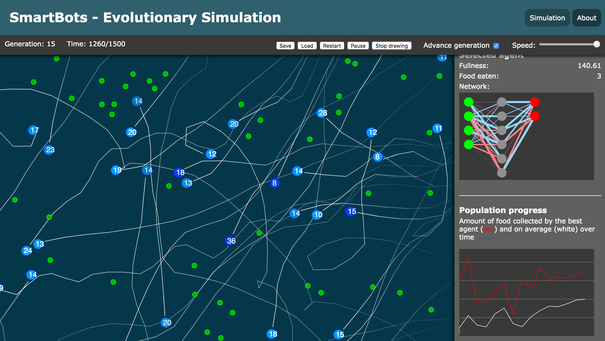

# SmartBots - Evolutionary Simulation

[View the simulation](https://neptunianeclipse.github.io/ai-evolutionary-simulation/#)

This is a simulation written in HTML5 and JavaScript that uses genetic algorithms and neural networks to simulate a population of agents (you could imagine them as living cells, animals, robots etc.), which compete for survival. Each agent must eat food to avoid starving, but there is a limited amount of food available at any time. After a certain amount of time has passed, the simulation will advance to the next generation, in which a new population of agents is created from the combination and mutation of the genetic code of the previous population. The better an agent performs (the more food it collects), the more likely it is to be selected for breeding. This simulates natural selection, and results in the agents of each successive population performing better than the last.

